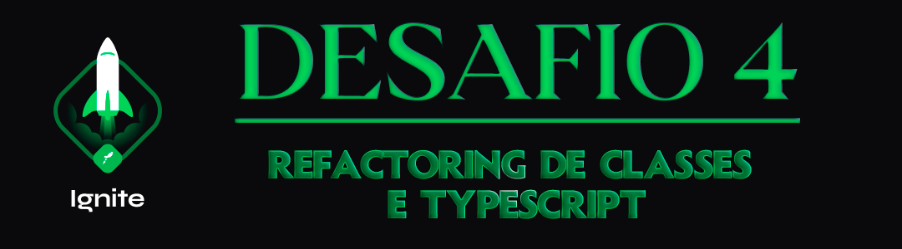

<div align="center">
  
</div>

<h1 align="center"> RocketSeat 🚀 Ignite ReactJS 🔥</h1>

<p align="center">
  <a href="https://rocketseat.com.br">
    
  </a>
  
  
  
</p>

## 🧠 Detalhes do desafio

Nesse desafio, você deverá criar uma aplicação para treinar o que aprendeu até agora no ReactJS

Essa será uma aplicação já funcional onde o seu principal objetivo é realizar dois processos de migração: de Javascript para Typescript e de Class Components para Function Components.

## ⚙️ Instalação do projeto

## Clone este repositório e acesse o diretório

```sh
$ git clone git@github.com:augustohermes/desafio-04-refactoring-de-classes-e-typescript.git && cd desafio-04-refactoring-de-classes-e-typescript
```

## Instale as dependências necessárias

```sh
$ yarn
```

## Iniciando a fake API

```sh
$ yarn server
```

## Rodando o projeto

```sh
$ yarn start
```

<br>

Feito com ❤️ por [Augusto Hermes](https://github.com/augustohermes) 👋.
